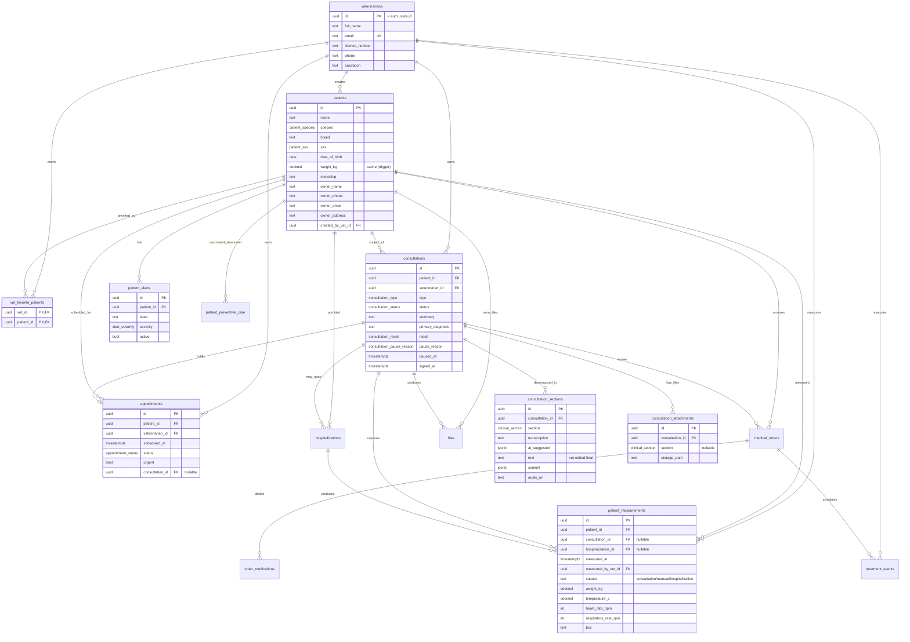

> Última actualización: 2026-04-29 · Schema: v2.5

# 02 — Modelo Entidad-Relación (MER)

## Diagrama

## Cardinalidades resumidas

| Relación | Cardinalidad | Notas |
|---|---|---|
| `veterinarians` 1—N `patients` | 1 vet crea N pacientes | `patients.created_by_vet_id` |
| `veterinarians` N—M `patients` (favoritos) | Vía `vet_favorite_patients` | PK compuesta `(vet_id, patient_id)` |
| `patients` 1—N `patient_alerts` | 1 paciente con N alertas activas/históricas | `active` flag para soft-disable |
| `patients` 1—N `consultations` | 1 paciente con N consultas | RESTRICT en delete (no se borra paciente con consultas) |
| `consultations` 1—N `consultation_sections` | 1 consulta con hasta 12 secciones | UNIQUE `(consultation_id, section)` — máximo una fila por sección por consulta |
| `consultations` 1—N `consultation_attachments` | Adjuntos opcionales | `section` puede ser NULL si el adjunto no pertenece a una sección concreta |
| `consultations` 1—1 `patient_measurements` (cuando source='consultation') | UNIQUE parcial | Una medición canónica por consulta firmada |
| `patients` 1—N `patient_measurements` | Histórico evolutivo de signos vitales | Source: consultation / manual / hospitalization |
| `consultations` 1—1 `appointments` (opcional) | Una cita puede materializar una consulta | `appointments.consultation_id` nullable |
| `consultations` 1—N `medical_orders` (Fase 2) | Una consulta puede emitir órdenes de tratamiento | Tablas declaradas, sin endpoints aún |
| `consultations` 1—N `hospitalizations` (Fase 2) | Una consulta puede abrir hospitalización | RESTRICT en delete |
| `medical_orders` 1—N `order_medications` | Una orden con medicamentos detallados | Cascade en delete |
| `medical_orders` 1—N `treatment_events` | Eventos programados de aplicación | Cascade |

## Reglas de integridad clave

- **Eliminación de paciente**: `RESTRICT` en `consultations.patient_id`, `appointments.patient_id`, `medical_orders.patient_id`, `hospitalizations.patient_id`. Un paciente con historia clínica **no se puede borrar**. Lo correcto es soft-disable (no implementado aún) o anonimización.
- **Eliminación de consulta**: cascade en `consultation_sections`, `consultation_attachments`. Las mediciones (`patient_measurements`) sobreviven con `consultation_id` puesto a NULL (ON DELETE SET NULL) — el histórico clínico no se pierde.
- **Eliminación de veterinarian**: `RESTRICT` en pacientes, consultas y citas. El borrado real solo ocurre vía `auth.users` (cascade desde Supabase Auth) y antes hay que reasignar dependencias.
- **Identidad del veterinario**: `veterinarians.id = auth.users.id`. La tabla `veterinarians` es 1:1 con el usuario de Supabase Auth, no genera UUID propios.

Ver [03-tablas.md](03-tablas.md) para columnas y constraints detallados, y [07-rls.md](07-rls.md) para las políticas de aislamiento.
