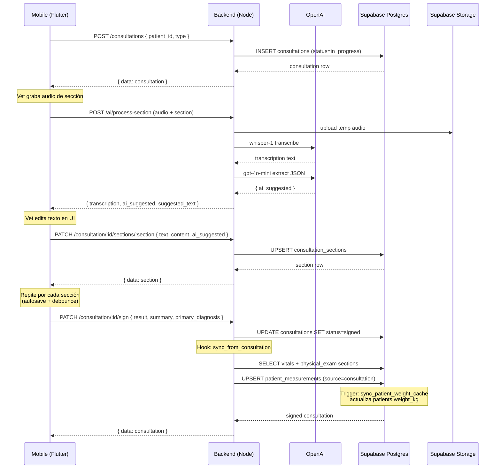
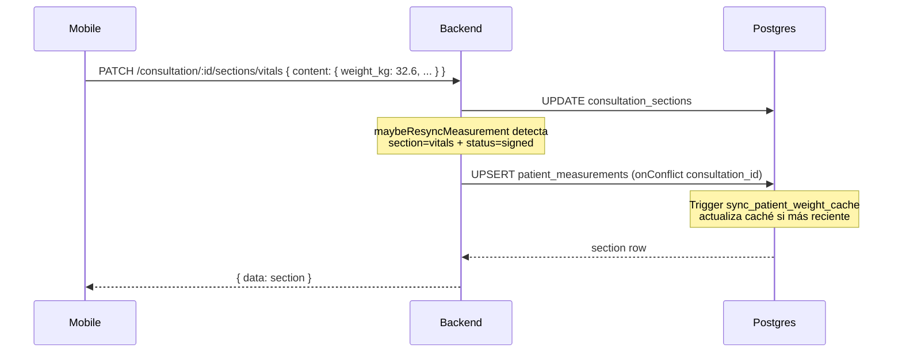
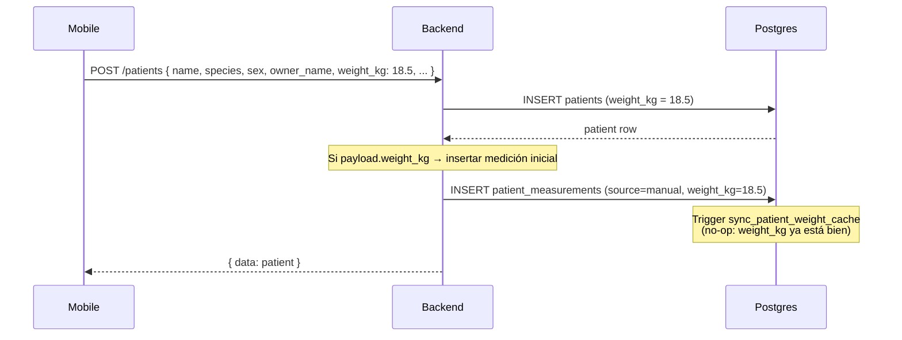
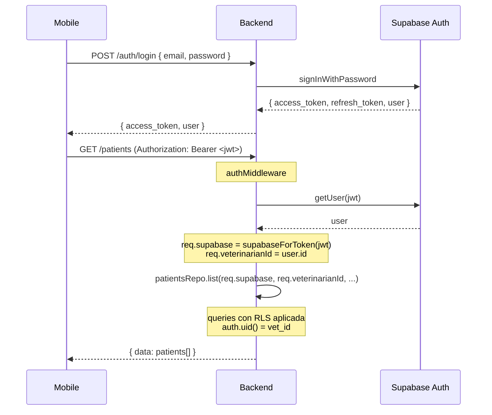
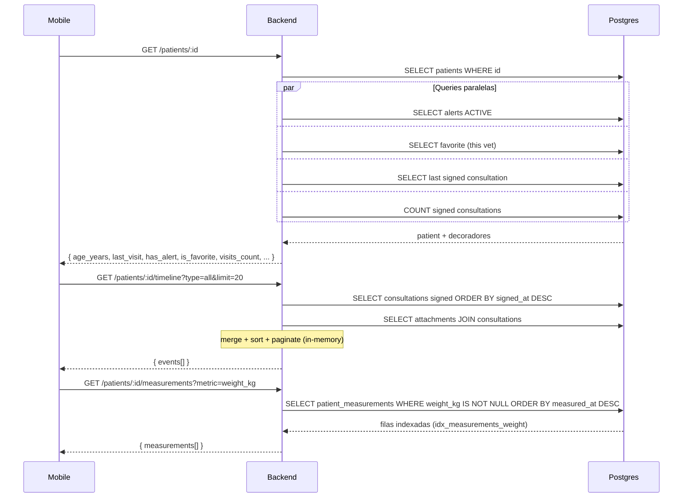
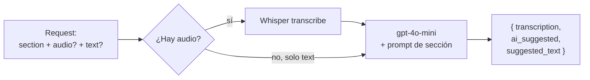

> Última actualización: 2026-04-29 · Schema: v2.3

# 09 — Flujos del sistema

Diagramas de secuencia de los flujos clave. Mermaid para render legible; el texto debajo describe los pasos para terminales sin renderer.

## Flujo 1 — Lifecycle de consulta (golden path)

Vet inicia consulta, dicta secciones, eventualmente firma. Este es el flujo más común.

### Pasos en texto

1. **Crear consulta** (`POST /consultations`): nace con `status=in_progress`. Sin secciones todavía.
2. **Procesar audio** (`POST /ai/process-section`): por cada sección dictada, el cliente envía audio + section name. El backend transcribe con Whisper, pasa al LLM con el prompt de la sección, y devuelve `{ transcription, ai_suggested, suggested_text }`. **No persiste** — el cliente decide qué hacer con el resultado.
3. **Persistir sección** (`PATCH /consultation/:id/sections/:section`): el cliente, tras edición humana del texto, envía cualquier subset de `{ text, content, transcription, ai_suggested, audio }`. Sirve como autosave/blur/pause. El upsert es parcial — solo escribe los campos que llegan.
4. **Pausar/reanudar** (`PATCH /consultation/:id/pause` / `/resume`): cambian `status`. Pause requiere `reason`.
5. **Firmar** (`PATCH /consultation/:id/sign`): cambia `status=signed`, registra `signed_at`, `result`, `summary`, `primary_diagnosis`. **Dispara el sync a `patient_measurements`**.
6. **Sync de mediciones**: el repo lee las secciones `vitals` y `physical_exam` de la consulta firmada, extrae signos vitales + BCS, hace upsert en `patient_measurements` con `source='consultation'`. Si la fila ya existe (re-firma o edición post-firma), se actualiza la misma. El trigger SQL `trg_sync_patient_weight` actualiza `patients.weight_kg` si la medición es la más reciente.

## Flujo 2 — Edición post-firma de vitals

Caso menos común pero soportado: el vet detecta un error en signos vitales después de firmar.

**Notas**:
- `sectionsRepo.maybeResyncMeasurement` consulta `consultations.status` antes de re-sincronizar. Si la consulta está `in_progress` o `paused`, no hace nada.
- El UNIQUE parcial sobre `consultation_id WHERE source='consultation'` garantiza idempotencia: el upsert actualiza la fila existente.

## Flujo 3 — Alta de paciente con peso inicial

Cuando el vet da de alta un paciente nuevo y captura su peso.

**Por qué la fila adicional**: garantiza que la gráfica histórica del paciente nunca arranque vacía. Sin esta inserción, la primera medición aparecería solo cuando el vet firme la primera consulta — entre alta y primera consulta puede haber un hueco.

## Flujo 4 — Login y obtención de cliente Supabase scoped

**Detalle**: `supabaseForToken(jwt)` crea un cliente con el JWT del usuario en el header. Eso significa que cualquier query que pase por `req.supabase` se ejecuta con la identidad del vet → RLS filtra correctamente.

## Flujo 5 — Endpoint de detalle de paciente (Fase 1)

Para alimentar la pantalla de detalle del móvil.

## Flujo 6 — Procesamiento de IA con / sin audio

`POST /ai/process-section` admite dos formas:

**Casos**:
- **Solo audio**: transcribe → LLM → output. `transcription` viene de Whisper.
- **Solo texto**: salta Whisper, va directo al LLM. `transcription` se devuelve igual al input (el frontend ya tiene texto editado).
- **Ambos**: usa el texto provisto, ignora el audio (caso edge — no es un patrón normal pero el endpoint lo tolera).

**`suggested_text`** es el resultado de `flattenAiToText(section, ai_suggested)` — toma el JSON del LLM y lo convierte en un texto labelizado (en español) listo para mostrar al vet en la UI. Esa función vive en `src/utils/flattenAiToText.js` y usa `src/utils/sectionLabels.js` para los nombres en español.
